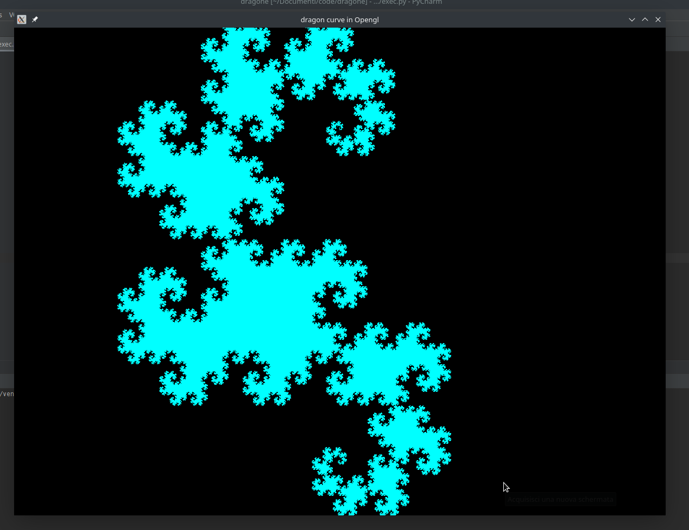
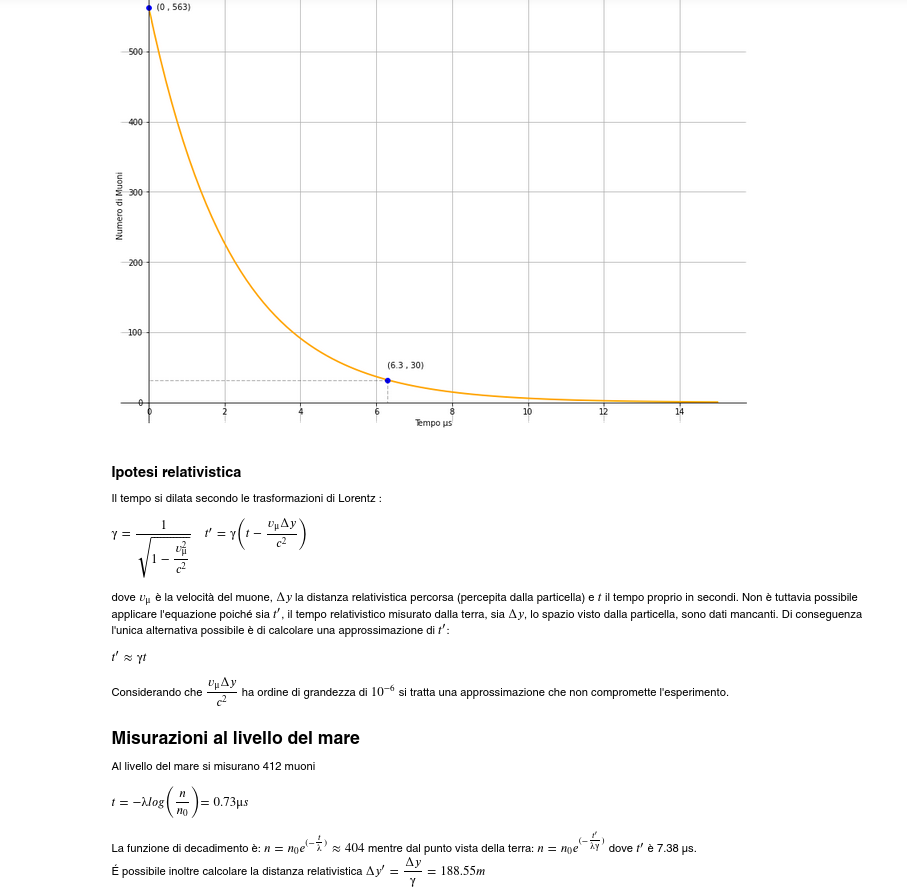
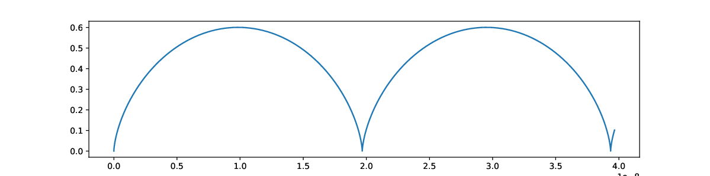
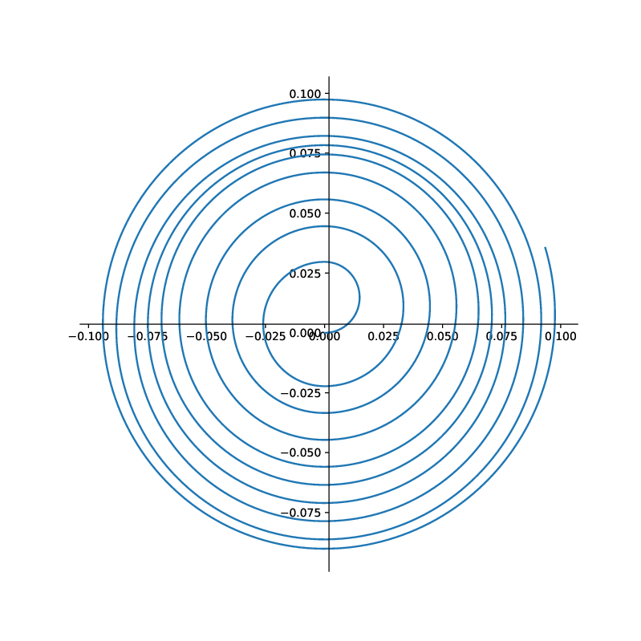
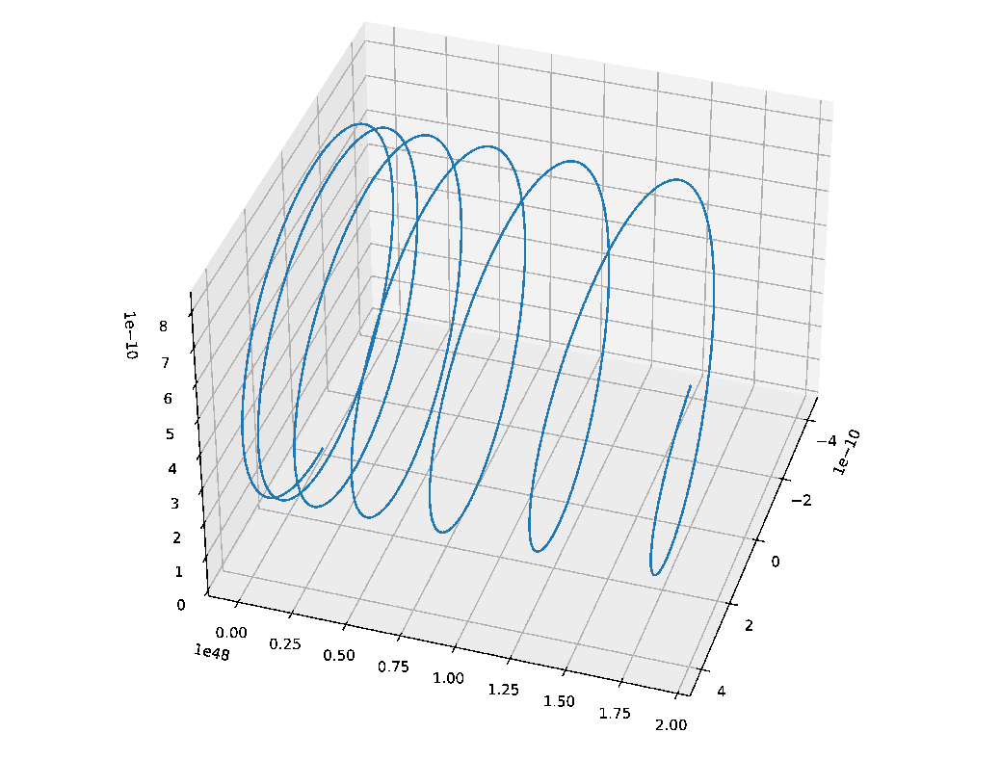
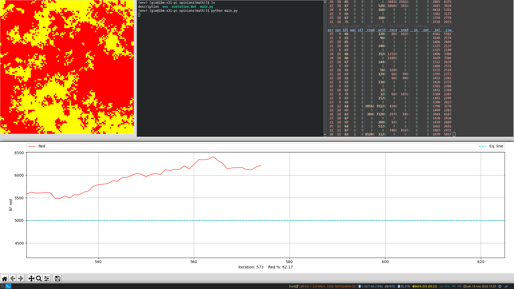

# python-liceo
This is a collection of little scripts and notebooks for my math and physics
classes. Here's the list:

## dragon curve
The dragon curve fractal (https://en.wikipedia.org/wiki/Dragon_curve) displayed using OpenGL
```
python dragon_curve/dragon_curve.py
```


## esperimento_dilatazione_tempo
Mount washington muon experiment illustrated with the special relativity theory and with classical physics <br>
Open with jupyter-notebook <br>
 <br>
Idea from https://www.youtube.com/watch?v=AZ2TTMLBWw8

## moti
Charged particle trajectories under eletric and magnetic field. Predicted using physics and tested
with numerical integration (and derivation), displayed with matplotlib
Open with jupyter-notebook





## opinioni
SIR model for covid simulation
```
python opinioni/main.py
```


## Virtual enviroment setup
Create virtualenv in local folder
```
$ python -m pip install --user virtualenv
$ python -m venv env
$ source env/bin/activate
```
Install dependences
```
pip install matplotlib tk numpy p5 PyOpenGL PyOpenGL_accelerate
# if errors occur install pyopengl globally, in Arch
yay python-opengl-accelerate
```
